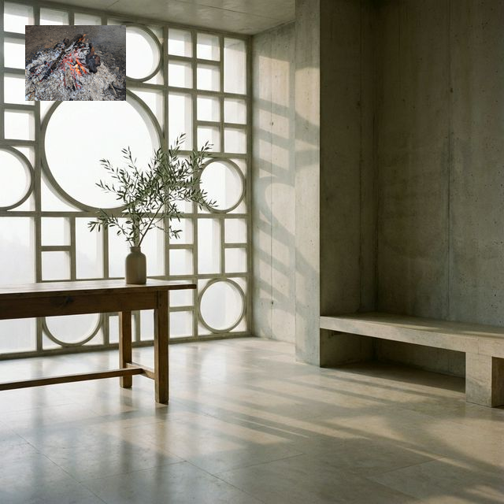

---
### 【1】Note用の長文記事
- **タイトル**: 古代の叡智をハックする——ストア派セラピーが教える「認知の防衛線」

- **冒頭あいさつ**: 日々押し寄せる不確実な出来事に対し、私たちは無意識のうちに感情の主導権を明け渡してはいないだろうか。
- **本文構成**:
  1. 導入（Hook）：
  「ストイック」という言葉には、ひたすら歯を食いしばって耐える禁欲的なイメージが付き纏う。しかし、本来のストア派哲学（ストイシズム）は、感情を抑圧するものではない。むしろ、現代の認知行動療法（CBT）の源流とも言える、極めて実用的で合理的な「認知のハック」の体系である。今回は、ストア派のツールキットから、私たちが日々実践できる心の養生法について構造化してみたい。

  2. 本論（Body）：
  ストア派の実践は、一日を通じた「ルーティン」として見事に体系化されている。その根底にあるのは、「コントロールの二分法」だ。自分がコントロールできること（自身の思考や行動）と、コントロールできないこと（他者の評価、天候、運命）を冷徹に峻別し、後者に対する執着を手放す。

  **朝のルーティン：災厄の予期（プレメディタティオ・マロルム）**
  朝、目覚めたときに彼らが行うのは、今日起こり得る最悪の事態を具体的にシミュレーションすることだ。これは一見すると悲観的に思えるが、進化心理学的な視点からも理にかなっている。未知の脅威に対する脳の過剰反応を、事前のシミュレーションによって「既知のもの」へ変換し、ネガティブな感情のバーストを未然に防ぐ防衛線を構築しているのだ。

  **日中の実践：プロソケー（継続的なマインドフルネス）**
  日中は、常に「理性的な観察者」としての視点を保つ。不都合な出来事が起きたとき、それを「悪いこと」と意味付けしているのは自分自身の認知フィルターに過ぎない。ストア派は、困難を「自らの卓越性（徳）を発揮するための機会」と捉え直す。事実（WHAT）をありのままに直視し、そこに余計な感情的評価（Why me?）を介入させない。

  **夜の内省：死の観想（メメント・モリ）と全体の観想**
  眠りにつく前には、その日の行動を振り返るとともに、「全体の観想」を行う。宇宙の悠久の歴史や、オリンポス山から見下ろすようなマクロな視点を持つことで、自分が抱えている悩みの小ささを客観視する。さらに「死の観想」によって、明日が当然やってくるというバイアスを取り払い、ただ今ここに存在しているという事実への強烈な感謝を呼び覚ますのである。

  3. 結論（Conclusion）：
  この古代のツールキットが教えてくれるのは、出来事そのものが私たちを苦しめるのではなく、出来事に対する「私たちの判断」が苦しみを生み出しているという冷徹な事実だ。無為自然の境地に至るためには、まず自らの認知の偏りをメタ認知し、システムとして感情の動揺をマネジメントする「型」を持つ必要がある。

- **読者へのアドバイスと結び**:
  まずは朝の5分間、「今日起こり得る不都合なこと」を書き出し、それらが自分のコントロール外であることを確認してみてほしい。これだけでも、一日の風景が静寂を伴って見えてくるはずだ。
- **ハッシュタグ**: #ストア派哲学 #認知行動療法 #メタ認知 #レジリエンス #マインドフルネス

---
### 【2】Suno用の音楽生成指示書（プロンプト）
- **Title (タイトル案)**: The Quiet Architecture
- **Style of Music (音楽ジャンル/スタイル)**: lo-fi chillhop, smooth acoustic guitar, minimalistic electronic beats, ambient, calm male vocal
- **Lyrics (歌詞案)**:
夜明け前の冷たい空気
頭のなかで線を引く
変えられるもの、変わらないもの
ノイズを削ぎ落とす幾何学

出来事が私を傷つけるんじゃない
私がそれを刃に変えているだけ
静かなる建築家のように
今日という一日を設計する

---
### 【3】X（旧Twitter）用のポスト文（拡散用）
朝一番に「今日起こり得る最悪の事態」をリアルに想像する。一見ネガティブなこの習慣が、実は最強のメンタル防衛線になる。2000年前のストア派哲学は、現代の「認知行動療法」の源流。出来事の解釈をハックする実用的なツールキットを構造化しました。

▼続きはこちら
[URL]
#ストア派 #認知行動療法

---
### 【4】Facebook用のポスト文（拡散用）
「ストイック」という言葉の本来の意味を誤解していませんか。

歯を食いしばって苦痛に耐えるのがストア派ではありません。彼らがやっていたのは、自分が「コントロールできること」と「できないこと」を冷徹に峻別し、後者をあっさりと手放す極めて合理的な「認知のハック」でした。

例えば、朝に「災厄の予期」というシミュレーションを行うことで、未知のストレスに対する脳の過剰反応を未然に防ぎます。これは現代の認知行動療法（CBT）とも完全に符合する科学的なアプローチです。

感情に振り回されず、静かなる理性で日々を構築するための「ストア派のツールキット」について、Noteで詳しく考察しました。

▼詳細な考察はこちらのNoteにまとめました
[URL]

---
### 【5】Instagram用の画像指示書とキャプション（拡散用）
- **画像構成案（1枚目〜3枚目）**: 
  - **1枚目**: 【テキスト中心】大きく「メンタル最強な人が、毎朝やっている『あること』」というタイトル。背景は夜明けの静かでミニマルな部屋の風景（暗め）。
  - **2枚目**: 【図解・図形】中央に線を引いて「コントロールできないこと（天候、他人の機嫌）」と「コントロールできること（自分の解釈、行動）」に分けた図表。タイトルは「コントロールの二分法」。
  - **3枚目**: 【テキスト】「出来事が苦しいのではない。あなたの『解釈』が苦しみを作っている。〜2000年前のストア派の叡智〜」という引用風のデザイン。

- **キャプション（本文）**: 
「ストイック」の本当の意味、知っていますか？ただ我慢することではなく、自分の認知フィルターをハックして、余計な摩擦を減らす合理的な技術のことです。
今回は、現代の認知行動療法の源流とも言える「ストア派の養生法」について構造化しました。
朝のたった5分のシミュレーションが、一日の景色をどう変えるのか。

▼プロフィールのリンク（またはストーリーズ）からNoteの記事をチェック！
[URL]

- **ハッシュタグ**: #ストア派哲学 #ストイシズム #マインドフルネス #認知行動療法 #レジリエンス #メンタルヘルス #思考の整理 #自己改善 #哲学 #心理学 #マインドセット #朝のルーティン #静けさ
