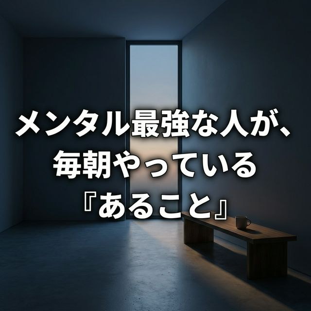
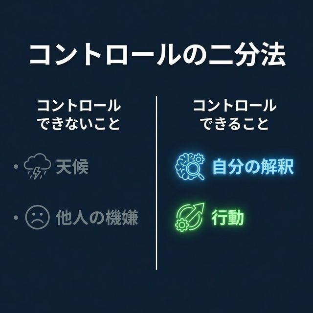
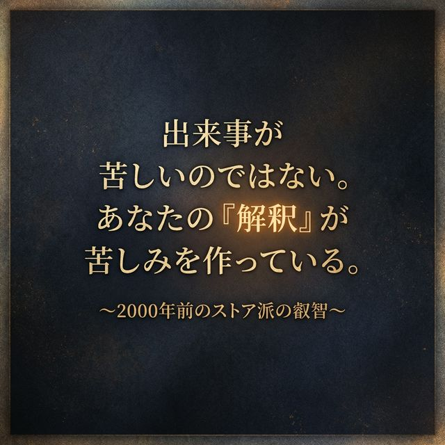

# 古代の叡智をハックする——ストア派セラピーが教える「認知の防衛線」

　日々押し寄せる不確実な出来事に対し、私たちは無意識のうちに感情の主導権を明け渡してはいないだろうか。

　「ストイック」という言葉には、ひたすら歯を食いしばって耐える禁欲的なイメージが付き纏う。しかし、本来のストア派哲学（ストイシズム）は、感情を抑圧するものではない。むしろ、現代の認知行動療法（CBT）の源流とも言える、極めて実用的で合理的な「認知のハック」の体系である。今回は、ストア派のツールキットから、私たちが日々実践できる心の養生法について構造化してみたい。

---

## コントロールの二分法

　ストア派の実践は、一日を通じた「ルーティン」として見事に体系化されている。その根底にあるのは、「コントロールの二分法」だ。自分がコントロールできること（自身の思考や行動）と、コントロールできないこと（他者の評価、天候、運命）を冷徹に峻別し、後者に対する執着を手放す。

---

## 日々のルーティン：朝・昼・夜の実践

　**朝のルーティン：災厄の予期（プレメディタティオ・マロルム）**
　朝、目覚めたときに彼らが行うのは、今日起こり得る最悪の事態を具体的にシミュレーションすることだ。これは一見すると悲観的に思えるが、進化心理学的な視点からも理にかなっている。未知の脅威に対する脳の過剰反応を、事前のシミュレーションによって「既知のもの」へ変換し、ネガティブな感情のバーストを未然に防ぐ防衛線を構築しているのだ。

　**日中の実践：プロソケー（継続的なマインドフルネス）**
　日中は、常に「理性的な観察者」としての視点を保つ。不都合な出来事が起きたとき、それを「悪いこと」と意味付けしているのは自分自身の認知フィルターに過ぎない。ストア派は、困難を「自らの卓越性（徳）を発揮するための機会」と捉え直す。事実（WHAT）をありのままに直視し、そこに余計な感情的評価（Why me?）を介入させない。

　**夜の内省：死の観想（メメント・モリ）と全体の観想**
　眠りにつく前には、その日の行動を振り返るとともに、「全体の観想」を行う。宇宙の悠久の歴史や、オリンポス山から見下ろすようなマクロな視点を持つことで、自分が抱えている悩みの小ささを客観視する。さらに「死の観想」によって、明日が当然やってくるというバイアスを取り払い、ただ今ここに存在しているという事実への強烈な感謝を呼び覚ますのである。

---

## システムとしての「型」を持つ

　この古代のツールキットが教えてくれるのは、出来事そのものが私たちを苦しめるのではなく、出来事に対する「私たちの判断」が苦しみを生み出しているという冷徹な事実だ。無為自然の境地に至るためには、まず自らの認知の偏りをメタ認知し、システムとして感情の動揺をマネジメントする「型」を持つ必要がある。

　まずは朝の5分間、「今日起こり得る不都合なこと」を書き出し、それらが自分のコントロール外であることを確認してみてほしい。これだけでも、一日の風景が静寂を伴って見えてくるはずだ。

---
杢之助
[Digital Twin & Context Architect]

---
(以下はNoteのハッシュタグ設定用)
#ストア派哲学 #認知行動療法 #メタ認知 #レジリエンス #マインドフルネス

---
### 【2】Suno用の音楽生成指示書（プロンプト）
- **Title (タイトル案)**: The Quiet Architecture
- **Style of Music (音楽ジャンル/スタイル)**: [1000文字以内の英語]
An atmospheric, emotionally resonant, and philosophical alternative pop/rock track. The mood starts calm and contemplative, driven by a melancholic but determined acoustic guitar and ambient, shimmering synth textures. It gradually builds into a powerful, anthemic mid-tempo rhythm with deep, grounding basslines and steady, atmospheric percussion. The vocal style is intimate and conversational during the verses, reflecting deep introspection and mental resilience, but expands into a soaring, emotionally cathartic, and empowering delivery in the chorus. Subtle elements of lo-fi chillhop, cinematic post-rock crescendo, and cinematic soundscapes underscore the lyrical themes of stoicism, mental architecture, and emotional control. The arrangement should feel like a progression from chaos to profound, unshakeable inner peace, ending with a lingering, tranquil fade-out.

- **Lyrics (歌詞案)**: [3000文字以内の日本語]
(Verse 1)
冷たい夜明けの空気を吸い込んで
ノートの真ん中に一本の線を引く
「私が変えられるもの」「私には変えられないもの」
ノイズにまみれた世界で、静かに幾何学を組む

(Pre-Chorus)
最悪のシナリオを先回りして見つめる
恐れは「未知」だから巨大に見えるだけ
悲観じゃない、これは心の防衛線
理性のフィルターが、今日という盾になる

(Chorus)
出来事が私を傷つけるんじゃない
私がそれを刃に変えているだけ
コントロールの境界線を見極めて
手放す勇気が、本当の自由をくれる
I'm building my quiet architecture
感情の嵐のなかで、静かなる建築家になる

(Verse 2)
理不尽な雨が降る、他人の冷たい視線が刺さる
だけどそれはただの「現象（WHAT）」に過ぎない
「なぜ私ばかり」という余計な意味づけを捨てて
ただ自分の卓越性を磨く砥石にする

(Bridge)
オリンポスの山頂から見下ろせば
私の悩みなんて、砂粒よりも小さい
そしていつか必ず訪れる終わりの日（メメント・モリ）
だからこそ、今ここにある命が愛おしい

(Chorus)
出来事が私を傷つけるんじゃない
私がそれを刃に変えているだけ
コントロールの境界線を見極めて
手放す勇気が、本当の自由をくれる
I'm building my quiet architecture
感情の嵐のなかで、静かなる建築家になる

(Outro)
ノイズを削ぎ落とした、静寂の風景
朝の5分間から始まる、わたしの革命
Stoic serenity, quiet mind...
今日という一日を、美しく設計する

---
### 【3】X（旧Twitter）用のポスト文（拡散用）
朝一番に「今日起こり得る最悪の事態」をリアルに想像する。一見ネガティブなこの習慣が、実は最強のメンタル防衛線になる。2000年前のストア派哲学は、現代の「認知行動療法」の源流。出来事の解釈をハックする実用的なツールキットを構造化しました。

▼続きはこちら
[https://note.com/jf3esp/n/n6e0ee92bb90b?sub_rt=share_pb]
#ストア派 #認知行動療法

---
### 【4】Facebook用のポスト文（拡散用）
「ストイック」という言葉の本来の意味を誤解していませんか。

歯を食いしばって苦痛に耐えるのがストア派ではありません。彼らがやっていたのは、自分が「コントロールできること」と「できないこと」を冷徹に峻別し、後者をあっさりと手放す極めて合理的な「認知のハック」でした。

例えば、朝に「災厄の予期」というシミュレーションを行うことで、未知のストレスに対する脳の過剰反応を未然に防ぎます。これは現代の認知行動療法（CBT）とも完全に符合する科学的なアプローチです。

感情に振り回されず、静かなる理性で日々を構築するための「ストア派のツールキット」について、Noteで詳しく考察しました。

▼詳細な考察はこちらのNoteにまとめました
[https://note.com/jf3esp/n/n6e0ee92bb90b?sub_rt=share_pb]

---
### 【5】Instagram用の画像とキャプション（拡散用）
- **画像（1枚目〜3枚目）**: 
👉 生成画像は [05_Instagram](../05_Instagram/) フォルダに格納
  - 1枚目: 
  - 2枚目: 
  - 3枚目: 

- **キャプション（本文）**: 
「ストイック」の本当の意味、知っていますか？ただ我慢することではなく、自分の認知フィルターをハックして、余計な摩擦を減らす合理的な技術のことです。
今回は、現代の認知行動療法の源流とも言える「ストア派の養生法」について構造化しました。
朝のたった5分のシミュレーションが、一日の景色をどう変えるのか。

▼プロフィールのリンク（またはストーリーズ）からNoteの記事をチェック！
[https://note.com/jf3esp/n/n6e0ee92bb90b?sub_rt=share_pb]

- **ハッシュタグ**: #ストア派哲学 #ストイシズム #マインドフルネス #認知行動療法 #レジリエンス #メンタルヘルス #思考の整理 #自己改善 #哲学 #心理学 #マインドセット #朝のルーティン #静けさ
